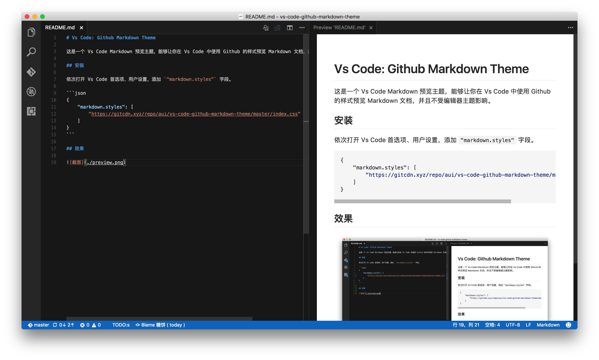

# Vs Code: Github Markdown Theme

这是一个 Vs Code Markdown 预览主题，能够让你在 Vs Code 中使用 Github 的样式预览 Markdown 文档，并且不受编辑器主题影响。

## 安装

依次打开 Vs Code 首选项、用户设置，添加 `"markdown.styles"` 字段。

```json
{
    "markdown.styles": [
        "https://gitcdn.xyz/repo/aui/vs-code-github-markdown-theme/master/index.css"
    ]
}
```

## 效果

